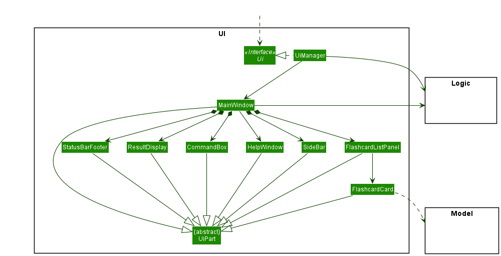
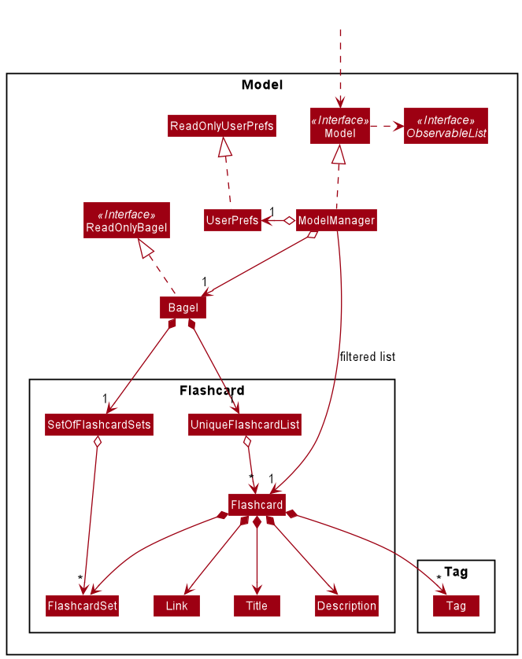
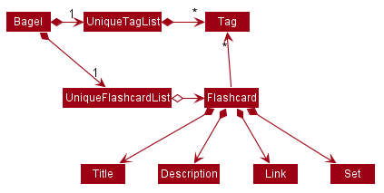
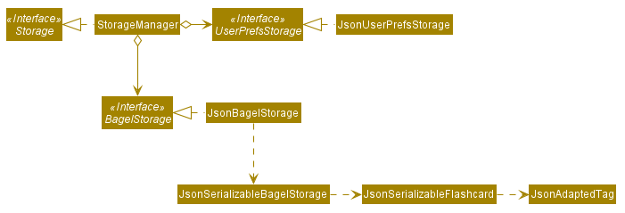
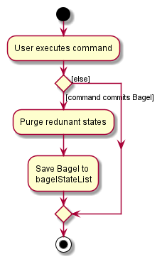

* Table of Contents
{:toc}

--------------------------------------------------------------------------------------------------------------------

## **Setting up, getting started**

Refer to the guide [_Setting up and getting started_](SettingUp.md).

--------------------------------------------------------------------------------------------------------------------

## **Design**

### Architecture

The ***Architecture Diagram*** given above explains the high-level design of the App. Given below is a quick overview of each component.

:bulb: **Tip:** The `.puml` files used to create diagrams in this document can be found in the [diagrams](https://github.com/se-edu/addressbook-level3/tree/master/docs/diagrams/) folder. Refer to the [_PlantUML Tutorial_ at se-edu/guides](https://se-education.org/guides/tutorials/plantUml.html) to learn how to create and edit diagrams.

**`Main`** has two classes called [`Main`](https://github.com/se-edu/addressbook-level3/tree/master/src/main/java/seedu/address/Main.java) and [`MainApp`](https://github.com/se-edu/addressbook-level3/tree/master/src/main/java/seedu/address/MainApp.java). It is responsible for,
* At app launch: Initializes the components in the correct sequence, and connects them up with each other.
* At shut down: Shuts down the components and invokes cleanup methods where necessary.

[**`Commons`**](#common-classes) represents a collection of classes used by multiple other components.

The rest of the App consists of four components.

* [**`UI`**](#ui-component): The UI of the App.
* [**`Logic`**](#logic-component): The command executor.
* [**`Model`**](#model-component): Holds the data of the App in memory.
* [**`Storage`**](#storage-component): Reads data from, and writes data to, the hard disk.

Each of the four components,

* defines its *API* in an `interface` with the same name as the Component.
* exposes its functionality using a concrete `{Component Name}Manager` class (which implements the corresponding API `interface` mentioned in the previous point.

For example, the `Logic` component (see the class diagram given below) defines its API in the `Logic.java` interface and exposes its functionality using the `LogicManager.java` class which implements the `Logic` interface.

**How the architecture components interact with each other**

The *Sequence Diagram* below shows how the components interact with each other for the scenario where the user issues the command `delete 1`.

The sections below give more details of each component.

### UI component

**API** :
[`Ui.java`](https://github.com/se-edu/addressbook-level3/tree/master/src/main/java/seedu/address/ui/Ui.java)

The UI consists of a `MainWindow` that is made up of parts e.g.`CommandBox`, `ResultDisplay`, `PersonListPanel`, `StatusBarFooter` etc. All these, including the `MainWindow`, inherit from the abstract `UiPart` class.

The `UI` component uses JavaFx UI framework. The layout of these UI parts are defined in matching `.fxml` files that are in the `src/main/resources/view` folder. For example, the layout of the [`MainWindow`](https://github.com/se-edu/addressbook-level3/tree/master/src/main/java/seedu/address/ui/MainWindow.java) is specified in [`MainWindow.fxml`](https://github.com/se-edu/addressbook-level3/tree/master/src/main/resources/view/MainWindow.fxml)

The `UI` component,

* Executes user commands using the `Logic` component.
* Listens for changes to `Model` data so that the UI can be updated with the modified data.

### Logic component

**API** :
[`Logic.java`](https://github.com/se-edu/addressbook-level3/tree/master/src/main/java/seedu/address/logic/Logic.java)

1. `Logic` uses the `AddressBookParser` class to parse the user command.
1. This results in a `Command` object which is executed by the `LogicManager`.
1. The command execution can affect the `Model` (e.g. adding a flashcard).
1. The result of the command execution is encapsulated as a `CommandResult` object which is passed back to the `Ui`.
1. In addition, the `CommandResult` object can also instruct the `Ui` to perform certain actions, such as displaying help to the user.

Given below is the Sequence Diagram for interactions within the `Logic` component for the `execute("delete 1")` API call.

:information_source: **Note:** The lifeline for `DeleteCommandParser` should end at the destroy marker (X) but due to a limitation of PlantUML, the lifeline reaches the end of diagram.

### Model component

**API** : [`Model.java`](https://github.com/se-edu/addressbook-level3/tree/master/src/main/java/seedu/address/model/Model.java)

The `Model`,

* stores a `UserPref` object that represents the user’s preferences.
* stores the address book data.
* exposes an unmodifiable `ObservableList<Person>` that can be 'observed' e.g. the UI can be bound to this list so that the UI automatically updates when the data in the list change.
* does not depend on any of the other three components.

:information_source: **Note:** An alternative (arguably, a more OOP) model is given below. It has a `Tag` list in the `AddressBook`, which `Person` references. This allows `AddressBook` to only require one `Tag` object per unique `Tag`, instead of each `Person` needing their own `Tag` object. 

### Storage component

**API** : [`Storage.java`](https://github.com/se-edu/addressbook-level3/tree/master/src/main/java/seedu/address/storage/Storage.java)

The `Storage` component,
* can save `UserPref` objects in json format and read it back.
* can save the address book data in json format and read it back.

### Common classes

Classes used by multiple components are in the `seedu.addressbook.commons` package.

--------------------------------------------------------------------------------------------------------------------

## **Implementation**

This section describes some noteworthy details on how certain features are implemented.

### \[Proposed\] Undo/redo feature

#### Proposed Implementation

The proposed undo/redo mechanism is facilitated by `VersionedAddressBook`. It extends `AddressBook` with an undo/redo history, stored internally as an `addressBookStateList` and `currentStatePointer`. Additionally, it implements the following operations:

* `VersionedAddressBook#commit()` — Saves the current address book state in its history.
* `VersionedAddressBook#undo()` — Restores the previous address book state from its history.
* `VersionedAddressBook#redo()` — Restores a previously undone address book state from its history.

These operations are exposed in the `Model` interface as `Model#commitAddressBook()`, `Model#undoAddressBook()` and `Model#redoAddressBook()` respectively.

Given below is an example usage scenario and how the undo/redo mechanism behaves at each step.

Step 1. The user launches the application for the first time. The `VersionedAddressBook` will be initialized with the initial address book state, and the `currentStatePointer` pointing to that single address book state.

Step 2. The user executes `delete 5` command to delete the 5th flashcard in the address book. The `delete` command calls `Model#commitAddressBook()`, causing the modified state of the address book after the `delete 5` command executes to be saved in the `addressBookStateList`, and the `currentStatePointer` is shifted to the newly inserted address book state.

Step 3. The user executes `add n/David …​` to add a new flashcard. The `add` command also calls `Model#commitAddressBook()`, causing another modified address book state to be saved into the `addressBookStateList`.

:information_source: **Note:** If a command fails its execution, it will not call `Model#commitAddressBook()`, so the address book state will not be saved into the `addressBookStateList`.

Step 4. The user now decides that adding the flashcard was a mistake, and decides to undo that action by executing the `undo` command. The `undo` command will call `Model#undoAddressBook()`, which will shift the `currentStatePointer` once to the left, pointing it to the previous address book state, and restores the address book to that state.

:information_source: **Note:** If the `currentStatePointer` is at index 0, pointing to the initial AddressBook state, then there are no previous AddressBook states to restore. The `undo` command uses `Model#canUndoAddressBook()` to check if this is the case. If so, it will return an error to the user rather
than attempting to perform the undo.

The following sequence diagram shows how the undo operation works:

:information_source: **Note:** The lifeline for `UndoCommand` should end at the destroy marker (X) but due to a limitation of PlantUML, the lifeline reaches the end of diagram.

The `redo` command does the opposite — it calls `Model#redoAddressBook()`, which shifts the `currentStatePointer` once to the right, pointing to the previously undone state, and restores the address book to that state.

:information_source: **Note:** If the `currentStatePointer` is at index `addressBookStateList.size() - 1`, pointing to the latest address book state, then there are no undone AddressBook states to restore. The `redo` command uses `Model#canRedoAddressBook()` to check if this is the case. If so, it will return an error to the user rather than attempting to perform the redo.

Step 5. The user then decides to execute the command `list`. Commands that do not modify the address book, such as `list`, will usually not call `Model#commitAddressBook()`, `Model#undoAddressBook()` or `Model#redoAddressBook()`. Thus, the `addressBookStateList` remains unchanged.

Step 6. The user executes `clear`, which calls `Model#commitAddressBook()`. Since the `currentStatePointer` is not pointing at the end of the `addressBookStateList`, all address book states after the `currentStatePointer` will be purged. Reason: It no longer makes sense to redo the `add n/David …​` command. This is the behavior that most modern desktop applications follow.

The following activity diagram summarizes what happens when a user executes a new command:

#### Design consideration:

##### Aspect: How undo & redo executes

* **Alternative 1 (current choice):** Saves the entire address book.
  * Pros: Easy to implement.
  * Cons: May have performance issues in terms of memory usage.

* **Alternative 2:** Individual command knows how to undo/redo by
  itself.
  * Pros: Will use less memory (e.g. for `delete`, just save the flashcard being deleted).
  * Cons: We must ensure that the implementation of each individual command are correct.

_{more aspects and alternatives to be added}_

### \[Proposed\] Data archiving

_{Explain here how the data archiving feature will be implemented}_

--------------------------------------------------------------------------------------------------------------------

## **Documentation, logging, testing, configuration, dev-ops**

* [Documentation guide](Documentation.md)
* [Testing guide](Testing.md)
* [Logging guide](Logging.md)
* [Configuration guide](Configuration.md)
* [DevOps guide](DevOps.md)

--------------------------------------------------------------------------------------------------------------------

## **Appendix: Requirements**

### Product scope

**Target user profile**:

* computing students taking GER1000
* has a need to manage a significant number of flashcards
* prefer desktop apps over other types
* can type fast
* prefers typing to mouse interactions
* is reasonably comfortable using CLI apps

**Value proposition**: 
Bagel is a flashcard application faster than a typical mouse/GUI driven app with additional functionality such as 
adding tags, links, or comments. It targets computing students taking GER1000 because it is a module that requires
memorising many keywords and items, and computing students would prefer typing over other means of input.

### User stories

Priorities: High (must have) - `* * *`, Medium (nice to have) - `* *`, Low (unlikely to have) - `*`

| Priority | As a …​                                    | I want to …​                     | So that I can…​                                                        |
| -------- | ------------------------------------------ | ------------------------------ | ---------------------------------------------------------------------- |
| `* * *`  | user                                       | add flashcards                 | memorise them                 |
| `* * *`  | user                                       | delete my flashcards when I am done with them               | keep the list organised                                                                       |
| `* * *`  | user                                       | edit a flashcard                |  rephrase or fix mistakes that I originally wrote                                   |
| `* * *`  | user                                       | view individual flashcards          | read them |
| `* * *`    | user                                       | view a list of sets of flashcards that I currently have   | not mix them up                |
| `* * *`      | user  | “flip” through a set of flashcards           | memorise them                                                 |

### Use cases

(For all use cases below, the **System** is `Bagel` and the **Actor** is the `user`, unless specified otherwise)

**Use case: UC01 - Finding a flashcard**

**MSS**

1. User chooses to find a flashcard. 
2. User enters the keyword they would like to search for.
<<<<<<< HEAD
3. Bagel finds the flashcard and shows a list of flashcards that contain that keyword. 
  Use case ends.
=======
3. Bagel finds the flashcard and shows a list of flashcards that contain that keyword.

Use case ends.
>>>>>>> a0f1560e2c1a16498aa44176cfb5d7df4e027f0f

**Extensions**

<<<<<<< HEAD
2a. Bagel detects an error in the entered data.
    2a1. Bagel requests for the correct data.
    2a2. User enters new details. 
    Steps 2a1-2a2 are repeated until the data entered are correct.
    Use case resumes from step 3.
=======
* 2a. Bagel detects an error in the entered data.
    * 2a1. Bagel requests for the correct data.
    * 2a2. User enters new details.
    * Steps 2a1-2a2 are repeated until the data entered are correct.

Use case resumes from step 3.
>>>>>>> a0f1560e2c1a16498aa44176cfb5d7df4e027f0f

**Use case: UC02 - Editing a flashcard**

**MSS**

1. User chooses to edit a flashcard.
2. User enters ‘list’ to view indexes of flashcards.
3. Bagel shows the list of flashcards.
4. User enters the index of the flashcard they would like to edit, and the details to edit.
5. Bagel edits the flashcard and shows the edited flashcard.
Use case ends.

**Extensions**

<<<<<<< HEAD
4a. Bagel detects an error in the entered data.
    4a1. Bagel requests for the correct data.
    4a2. User enters new details. 
    Steps 4a1-4a2 are repeated until the data entered are correct.
    Use case resumes from step 5.
=======
* 4a. Bagel detects an error in the entered data.
    * 4a1. Bagel requests for the correct data.
    * 4a2. User enters new details.
    * Steps 4a1-4a2 are repeated until the data entered are correct.
    
Use case resumes from step 5.
>>>>>>> a0f1560e2c1a16498aa44176cfb5d7df4e027f0f

**Use case: UC03 - Deleting a flashcard**

**MSS**

1. User chooses to delete a flashcard.
2. User enters ‘list’ to view indexes of flashcards.
3. Bagel shows the list of flashcards.
<<<<<<< HEAD
4. User enters the index of the flashcard they would like to delete. 
5. Bagel deletes the flashcard and shows the new list of flashcards. 
Use case ends. 
=======
4. User enters the index of the flashcard they would like to delete.
5. Bagel deletes the flashcard and shows the new list of flashcards.

Use case ends.
>>>>>>> a0f1560e2c1a16498aa44176cfb5d7df4e027f0f

**Extensions**

<<<<<<< HEAD
4a. Bagel detects an error in the entered data.
    4a1. Bagel requests for the correct data.
    4a2. User enters new details. 
    Steps 4a1-4a2 are repeated until the data entered are correct.
    Use case resumes from step 5.
=======
* 4a. Bagel detects an error in the entered data.
    * 4a1. Bagel requests for the correct data.
    * 4a2. User enters new details.
    * Steps 4a1-4a2 are repeated until the data entered are correct.

Use case resumes from step 5.
>>>>>>> a0f1560e2c1a16498aa44176cfb5d7df4e027f0f

**Use case: UC04 - Flipping through flashcards**

**MSS**

1. User chooses to flip through the list of flashcards.
2. User enters ‘flip’ to start viewing from the first flashcard in the list.
3. Bagel shows the first flashcard.
4. User enters ‘flip’ to view the next flashcard in the list.
5. Bagel shows the next flashcard. 
Steps 4-5 are repeated for each flashcard, until the user reaches the end of the list.
<<<<<<< HEAD
6. Bagel shows the current list of flashcards. 
Use case ends. 
=======
6. Bagel shows the current list of flashcards.

Use case ends.
>>>>>>> a0f1560e2c1a16498aa44176cfb5d7df4e027f0f

**Extensions**

<<<<<<< HEAD
2a/4a. Bagel detects an error in the entered data. 
    2a1/4a1. Bagel requests for the correct data. 
    2a2/4a2. User enters new details. 
    Steps 2a1-2a2/4a1-4a2 are repeated until the data entered are correct.
    Use case resumes from step 3/5.
=======
* 2a/4a. Bagel detects an error in the entered data.
    * 2a1/4a1. Bagel requests for the correct data.
    * 2a2/4a2. User enters new details.
    * Steps 2a1-2a2/4a1-4a2 are repeated until the data entered are correct.

Use case resumes from step 3/5.
>>>>>>> a0f1560e2c1a16498aa44176cfb5d7df4e027f0f

### Non-Functional Requirements

1. Bagel should work on any _mainstream OS_ as long as it has Java `11` or above installed.
2. Bagel should be able to hold up to 500 flashcards without a noticeable sluggishness in performance for typical usage.
3. Bagel should be intuitive to use for first time users.
4. Bagel should be targeting users who can type fast and prefer typing over other means of input.
5. Bagel should respond within two seconds.
6. Bagel should show flashcards within one second of inputting the command. 
7. Any version of Bagel should function as long as the user has it installed. 
8. Bagel is expected to adhere to the CS2103T schedule. 
9. Bagel is not expected to quiz the user. 
10. Bagel should be for a single user. 

### Glossary

* **Mainstream OS**: Windows, Linux, Unix, OS-X

--------------------------------------------------------------------------------------------------------------------

## **Appendix: Instructions for manual testing**

Given below are instructions to test the app manually.

:information_source: **Note:** These instructions only provide a starting point for testers to work on;
testers are expected to do more *exploratory* testing.

### Launch and shutdown

1. Initial launch

   1. Download the jar file and copy into an empty folder

   1. Double-click the jar file Expected: Shows the GUI with a set of sample contacts. The window size may not be optimum.

1. Saving window preferences

   1. Resize the window to an optimum size. Move the window to a different location. Close the window.

   1. Re-launch the app by double-clicking the jar file. 
       Expected: The most recent window size and location is retained.

1. _{ more test cases …​ }_

### Deleting a flashcard

1. Deleting a flashcard while all flashcards are being shown

   1. Prerequisites: List all flashcards using the `list` command. Multiple flashcards in the list.

   1. Test case: `delete 1` 
      Expected: First contact is deleted from the list. Details of the deleted contact shown in the status message. Timestamp in the status bar is updated.

   1. Test case: `delete 0` 
      Expected: No flashcard is deleted. Error details shown in the status message. Status bar remains the same.

   1. Other incorrect delete commands to try: `delete`, `delete x`, `...` (where x is larger than the list size) 
      Expected: Similar to previous.

1. _{ more test cases …​ }_

### Saving data

1. Dealing with missing/corrupted data files

   1. _{explain how to simulate a missing/corrupted file, and the expected behavior}_

1. _{ more test cases …​ }_
