Bagel is a **desktop app for managing flashcards, optimized for your use via a Command Line Interface** (CLI)
while still ensuring you the benefits of a Graphical User Interface (GUI).
If you can type fast, Bagel will be sure to aid you in managing your flashcards faster than traditional GUI apps.

### Table of Contents
{:.no_toc}

* Table of Contents
{:toc}

--------------------------------------------------------------------------------------------------------------------

## Quick start

1. Ensure you have Java 11 or above installed in your computer.
2. Download the latest `bagel.jar` from [here](https://github.com/AY2021S1-CS2103T-W13-2/tp/releases).
3. Copy the file to the folder you want to use as the home folder for Bagel.
4. Double-click the file to start the app. The GUI should appear in a few seconds. Note how the app contains some sample data. It should look like this:
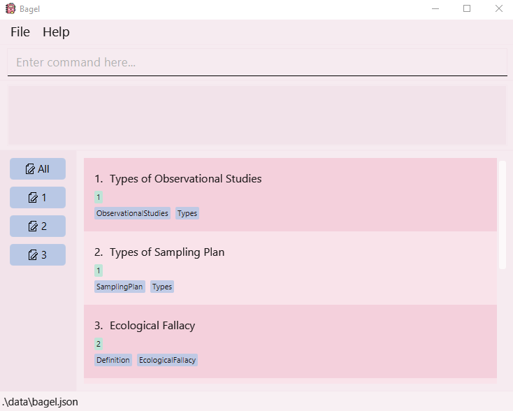
5. Type the command in the command box and press Enter to execute it. e.g. typing `help` and pressing Enter will open the help window.
    Some example commands you can try:
    * `list` : Lists all flashcards.
    * `add t/Data Analysis d/Definition of data analysis: xxxxxx` : Adds a flashcard with the title
        'Data Analysis' and description of 'Definition of data analysis: xxxxxx' to the list of flashcards.
    * `clear` : Clears all flashcard entries.
    * `delete 3` : Deletes the 3rd flashcard shown in the currently displayed flashcard list.
    * `view 3` : Shows the 3rd flashcard shown in the currently displayed flashcard list.
    * `edit 2 t/new title` : Edits the title of 2nd flashcard of the currently displayed flashcard list to become 'new title'.
    * `flip` : Flips from the current flashcard to next flashcard in the list.
    * `search k/keyword`: Searches for flashcards that have the matching title or description.
    * `sort r/atitle`: Sorts the flashcard list according to title, in ascending order.
    * `exit` : Exits the app. 

Read on to find out more about Bagel with us!

--------------------------------------------------------------------------------------------------------------------

## Preface (How should I navigate this entire document?)

### Structure

Our team at Bagel has structured this User Guide to improve your reading experience and aid you in locating the information you are searching for efficiently. 
Below, we will provide a few useful tips on how to optimally read this guide.
We will then proceed to elaborate on the features of Bagels with concrete examples that you can try out to get used to our interface!

### How can you optimally read this guide?

Dread that you'll not be familiar with command-line interfaces or conventional technical terms? Afraid to feel lost amongst complicated technical jargon?
Here, we will guide you with through technical terms, symbols and syntax that are used throughout this guide. You may want to
take a brief look through this section before moving to the next section!

#### Understanding our GUI

The figure below is the GUI of **Bagel** with some annotations that we would like to guide you through:

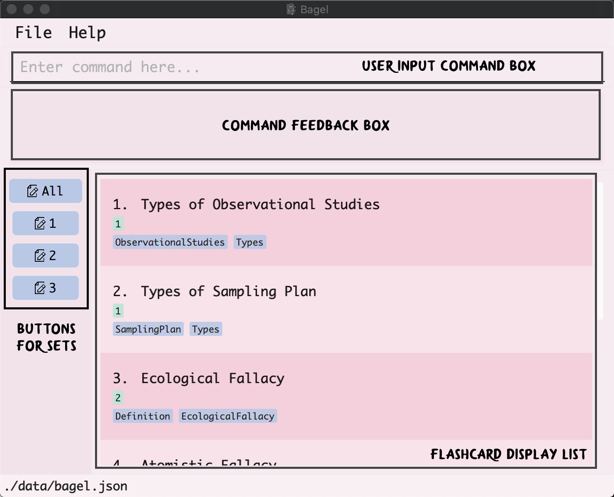  

Here is a table to better understand how to put our GUI into best use:

| GUI Feature |  What will it do? / What is this for? |
|----------|-------------|
| User Input Command Box  | This is where you can enter the relevant Bagel commands for it to execute. |
| Command Feedback Box | This box will provide you with feedback accordingly, (i.e. if your command has been executed). It is especially useful if your command fails to execute as it will provide you with the source of error! |
| Buttons for Sets | These buttons will appear and disappear automatically when you add a new set or delete all your flashcards in an existing set. This is a feature for point-and-click navigation, just in case you simply opened Bagel to revise and not make any changes! |
| Flashcard Display List | This list will display your selected list of flashcards (i.e. filtered or not). It will even show you a specific flashcard with all its details when you want it to (i.e. View Command). |

#### Bagel's Symbols and Syntax

The table below will guide you through the general symbols and specific technical terms used in our guide:

| Syntax |  Bagel's Definition |
|----------|-------------|
| 
 :information_source: 
  | An exclamation mark indicates that the following text is a tip. |
| 
 :warning: 
 | A warning sign indicates that the following text is important. |
| Command Word/Command | The specific word that is a command in Bagel which will determines an action that Bagel will perform for you. |
| Parameter | The words, phrases or values following each prefix given to a command to execute your specified action.|
| Prefix | The characters after every command word and at the start of a parameter. E.g. "/t" or "/d". |

**Here is an example to help you understand the table better:**  
`add t/TITLE d/DESCRIPTION s/SET [l/LINK] [tag/TAG]…`

* Command Word/Command: `add`  
* Parameters: `TITLE`, `DESCRIPTION`, `SET`, `LINK`, `TAG`  
* Prefixes: `t/`, `d/`, `s/`, `l/`, `t/`   

**:information_source: Notes about the command format:** 

* Words in `UPPER_CASE` are the parameters to be supplied by you. 
  e.g. in `add t/TITLE`, TITLE is the parameter which can be used.

* Items in square brackets are optional. 
  e.g. `t/TITLE [tag/TAG]` can be used as `t/p-value tag/Definition` or as `t/p-value`. 
  e.g. `[s/1]` is optional.

* Items with `…​` after them can be used multiple times including zero times. 
  e.g. in `[tag/TAG]…`, can be used as ` ` (i.e. 0 times), `tag/Definition, tag/Formula tag/Important` etc.

* User should supply the index of the flashcard behind commands. 
  e.g. `view 1`, `delete 10`.

* Parameters can be in any order. 
  e.g. if the command specifies `t/TITLE d/DESCRIPTION`, `d/DESCRIPTION t/TITLE` is also acceptable.

* Although it is not recommended to supply duplicate parameters, they will still be accepted. However,
only the last parameter supplied will be considered.
  e.g. if the command entered is `add t/title 1 t/title 2 d/description`, the title of the flashcard added will be
  `title 2`, as only `t/title 2` will be considered.

--------------------------------------------------------------------------------------------------------------------

## Features

### Adding a flashcard: `add`

Want to make a new flashcard? This command will add a new flashcard to your current list of flashcards, into the set that you have specified.

Format: `add t/TITLE d/DESCRIPTION s/SET [l/LINK] [tag/TAG]…​`

* Adds a flashcard with a title, description into a set.
* Title, description and set number (a positive integer between 1 and 20) must be entered.
  * The set number should not have any leading zeroes.
* You can even add an optional link. It should:
  * Have a protocol e.g. `https://example.com` instead of `example.com`.
  * Be absolute e.g. `file:///GER1000/example.png` instead of `file://example.png`.
  * Beware! Even if a URL is valid, it may not open, e.g. if the file does not exist.

**:information_source: Helpful notes about the command format:** 
Flashcards with different titles but same descriptions can still be added.

Examples:
* `add t/p-value d/If p value < 0.05, xxxx; Else, xxxx s/1` adds a new flashcard with details:
  * Title: `p-value`
  * Description: `If p value < 0.05, xxxx; Else, xxxx`
  * Set: `1`

* `add t/Data Analysis d/Definition of data analysis: xxxxxx s/2` adds a new flashcard with details:
  * Title: `Data Analysis`
  * Description: `Definition of data analysis: xxxxxx`
  * Set: `2`

* `add t/Odds Ratio(OR) and Risk Ratio(RR) d/R: odds(exp)/odds(unexp), RR: risk(exp)/risk(unexp) s/3 tag/OddsRatio`
adds a new flashcard with the details:
  * Title: `Odds Ratio(OR) and Risk Ratio(RR)`
  * Description: `R: odds(exp)/odds(unexp), RR: risk(exp)/risk(unexp)`
  * Tag(s): `OddsRatio`
  * Set: `3`

* `add t/Types of Observational Studies d/Prospective, Retrospective, Cross-sectional
l/https://en.wikipedia.org/wiki/Observational_study tag/Types tag/ObservationalStudies s/2` adds a new flashcard with
the details:
  * Title: `Types of Observational Studies`
  * Description: `Prospective, Retrospective, Cross-sectional`
  * Link: `https://en.wikipedia.org/wiki/Observational_study`
  * Tag(s): `Types` and `ObservationalStudies` 
  * Set: `2`

### Deleting a flashcard: `delete`

Don't want to see a flashcard anymore? This command will delete the specific flashcard that you specified from your list of flashcards.

Format: `delete INDEX`

* Deletes the flashcard at the specified `INDEX`.
* The index refers to the index number shown in the displayed flashcards list.
* The index **must be a positive integer** 1, 2, 3, …
* If only one flashcard is shown, its `INDEX` is `1`.

**:information_source: Warning:** 
Once you delete a flashcard, there is no way to undo this and retrieve it! Make sure that you have a copy of your file somewhere else, or
that you would like to delete this specific flashcard!

Example:
* `delete 1` will permanently delete/remove your flashcard that is set at index `1`

### Editing a flashcard: `edit`

Made a mistake? No worries! This command lets you edit a specific flashcard.

Format: `edit INDEX [t/TITLE] [d/DESCRIPTION] [s/SET] [l/LINK] [tag/TAG]…​`

* Edits the flashcard at the specified `INDEX`.
* The index refers to the index number shown in the displayed flashcard list.
* The index **must be a positive integer** 1, 2, 3, …
* If only one flashcard is shown, its `INDEX` is `1`.
* At least one of the optional fields must be provided.
* Existing values will be updated to the input values. New tags will be added without replacing any of the old tags.
* You can remove all the flashcard’s tags by typing `tag/` without specifying any tags after it.
* Similarly, you can remove the flashcard's link by typing `l/`.

Examples:
*  `edit 1 t/Data analysis` edits the title of the 1st flashcard to be `Data analysis`.
*  `edit 1 t/p-value d/probability of…` edits the title and description of the 1st flashcard to be `p-value` and `probability of…` respectively.
*  `edit 1 s/2` edits the set number which this flashcard is in, to `2`.
*  `edit 1 t/p-value tag/` edits the title of the 1st flashcard to be `p-value` and clears all existing tags.

Visual walkthrough:
1. Type `list` into the command box and hit enter to view all flashcards.
   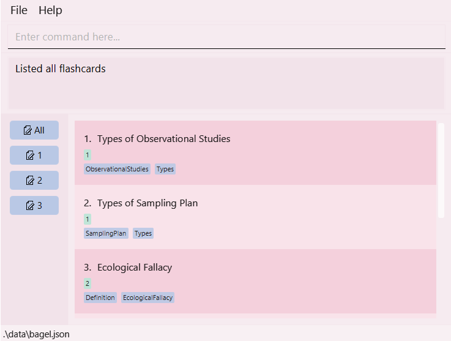
1. Look for the index of the card you want to edit. 
   For example, if you want to edit the flashcard with title `Types of Sampling Plan`, the index here is `2`, written to the left of the title.
1. Type `edit  2` in the command box, followed with the information to be edited. 
   For example, if you want to change the title to `Sampling Plan`, write `t/Sampling Plan`.
   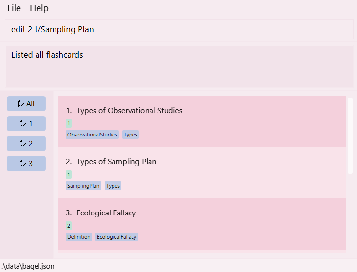
1. Press enter. A message should appear saying that the flashcard has been edited.
   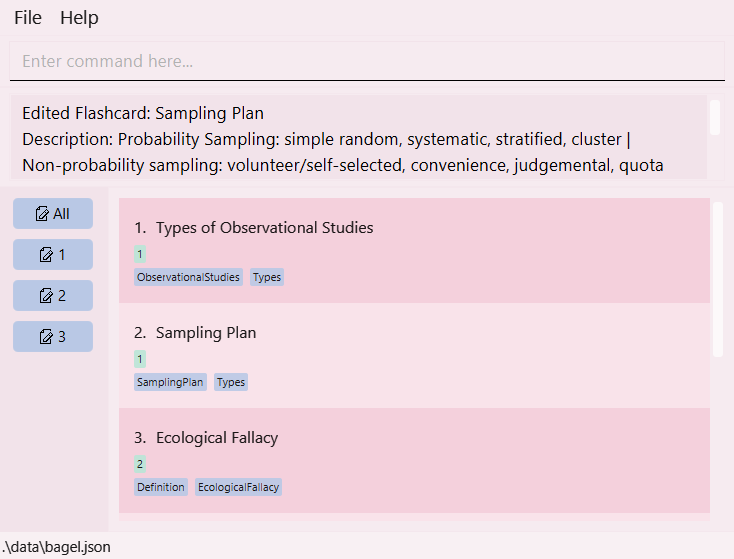

### Viewing a flashcard: `view`

Want to memorise a flashcard? This command shows you an existing flashcard in the currently displayed list.

Format: `view INDEX`

* The index refers to the index number shown in the currently displayed flashcards list.
* The index **must be a positive integer** 1, 2, 3, …

**:information_source: Notes about the command format:** 
* To view another flashcard, enter `list` to go back to the entire list of flashcards. Then `view INDEX` of the next flashcard
you would like to view.

Visual walkthrough: 
1. Use `list` to obtain the index of the flashcard you want to view. In this example, you want to view the flashcard with the
title `Types of Sampling Plan`.
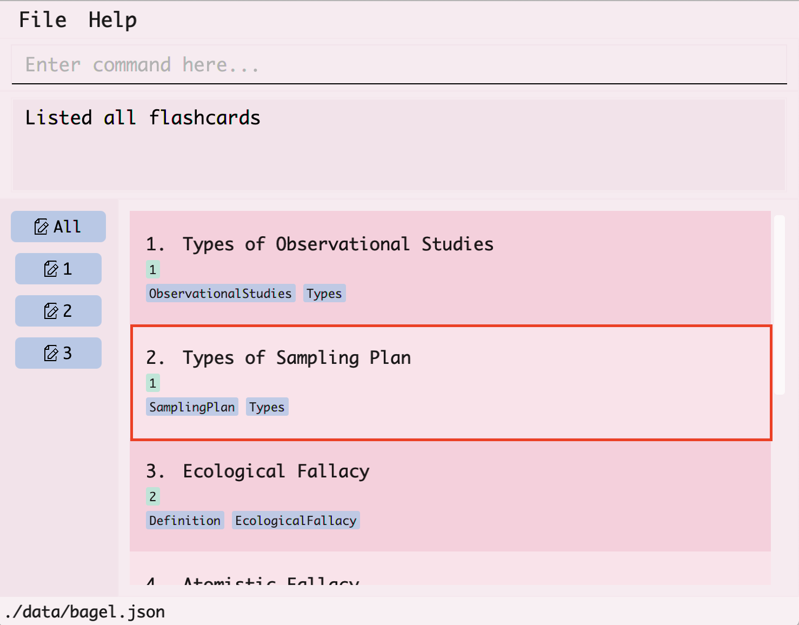
2. You can find the index of the flashcard by looking at the number at its left.
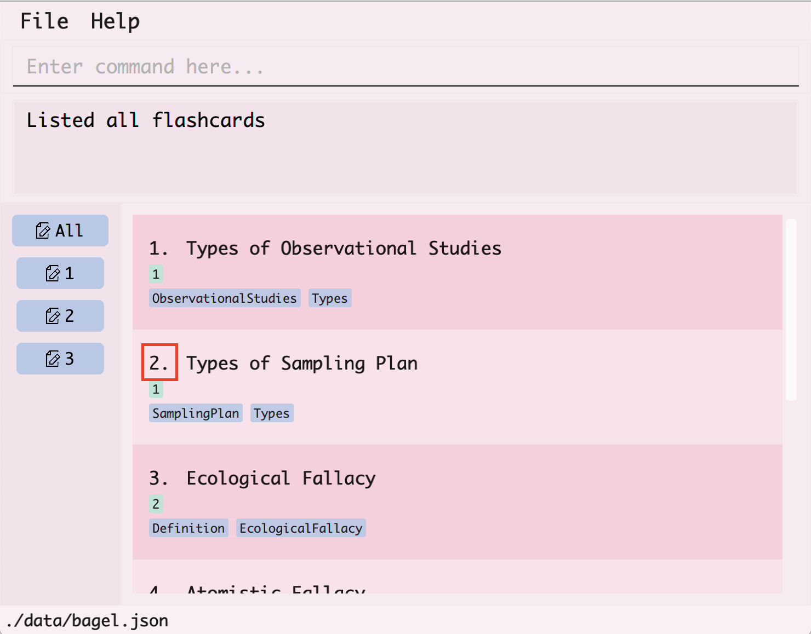
2. In the command box at the top, type `view`, followed by the index of the flashcard which is `2` and hit enter.
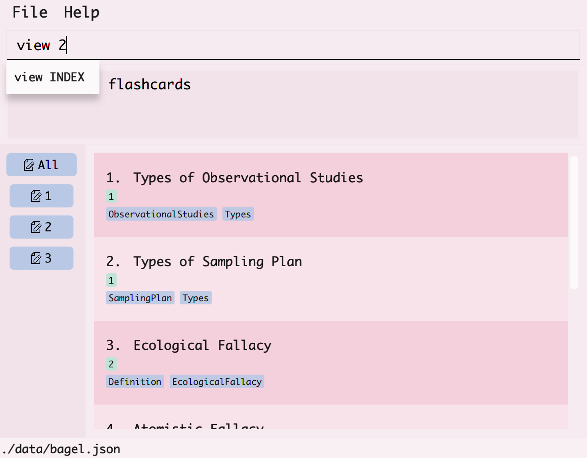
3. The flashcard with the title `Types of Sampling Plan` will then be displayed.
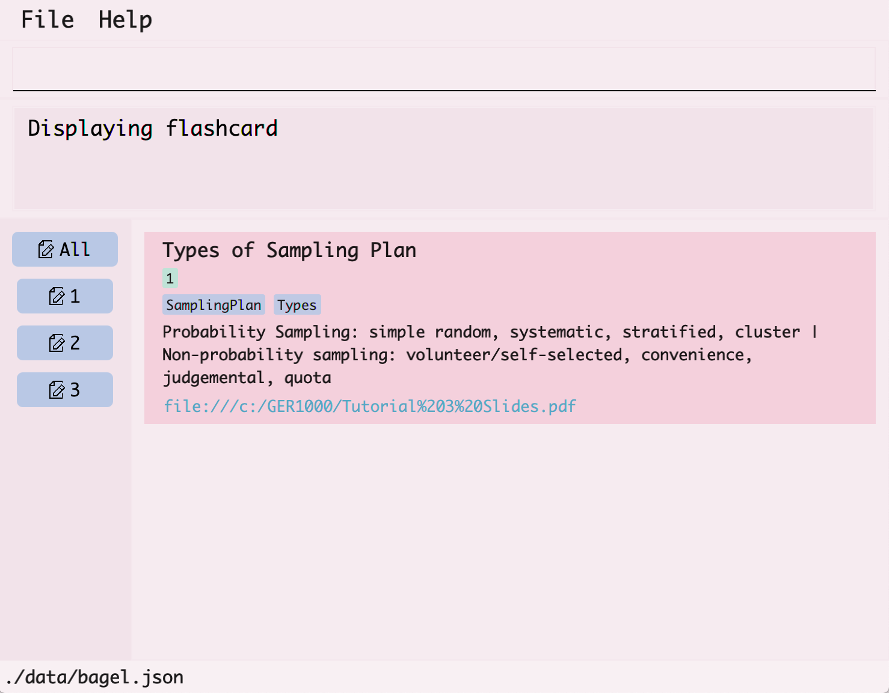

### Listing all flashcards: `list`

Want to see all flashcards? This command shows you a list of all flashcards created, or shows a list of all flashcards in a chosen set.

Format:
* `list` to show all flashcards created
* `list s/SET_NUMBER` to show all flashcards in set `SET_NUMBER`

Example:
* `list s/2` displays all flashcards in set `2`.

### Flipping through flashcards: `flip`

Want to flip through the list of flashcards? This command lets you flip from the current flashcard to the next flashcard in the sequence.
* Flips through all flashcards in Bagel, one at a time.
* If multiple flashcards are shown, the first flashcard at the top will be shown.
* Once the end of the sequence is reached, the first flashcard will be shown again.

Format: `flip`

Visual walkthrough:
1. Current flashcards in the sequence.

2. Type "flip" to show the first flashcard in the sequence.
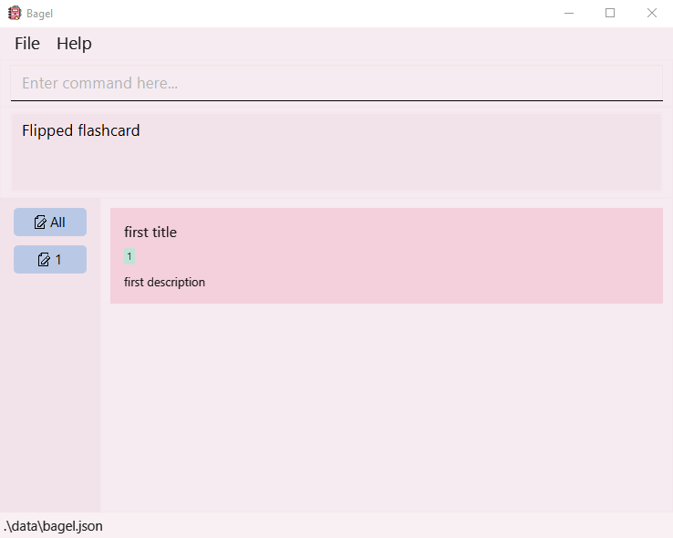
3. Type "flip" to show the next flashcard in the sequence.
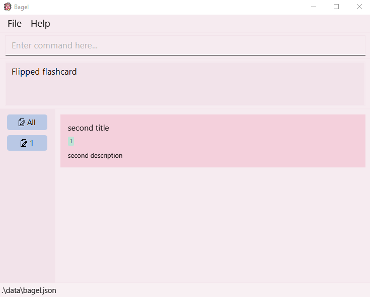

### Searching through flashcards: `search`

Want to search for a flashcard? This command searches for flashcards that have a matching title, description or tag with `KEYWORD` from all flashcards.

Format: `search k/KEYWORD`

* Searches for flashcards that match with `KEYWORD`.
* The search is case-insensitive. For example, k/apple can search for "apple" and "APPLe".

Examples:
*  `search k/testing` returns `testing1`, `testing2` and `testing23`
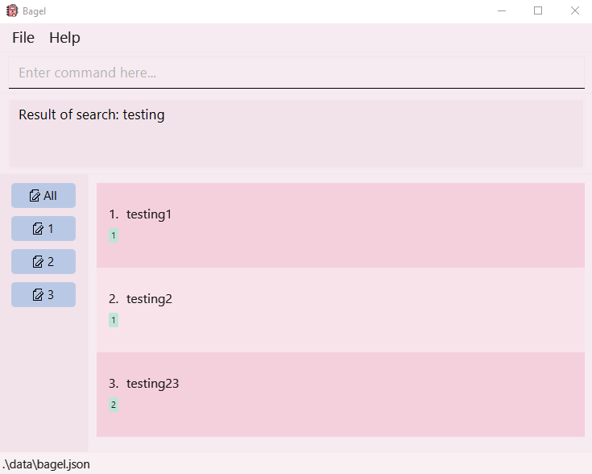

### Sorting flashcards: `sort`

Don't like how your list looks? This command lets you sort the entire flashcard list according to a requirement.

Format: `sort r/REQUIREMENT`

* Sorts the list by the specified requirement.
* The requirement **must be one of the following**:
    * atitle (ascending alphabetical order)
    * dtitle (descending alphabetical order)
    * tag

Examples:
* `sort r/tag` returns the list of flashcards, sorted according to each flashcard's first tag.
* `sort r/atitle` returns the list of flashcards, sorted in ascending alphabetical order.

**:information_source: Warning:** 
This sorts all flashcards in Bagel! If you wish to view a set that is differently sorted
from another set, `sort r/REQUIREMENT` again for that set.

Visual walkthrough:
1. You want to sort your list of flashcards by ascending title.
2. Type `sort`, followed by `r/atitle` for the requirement.
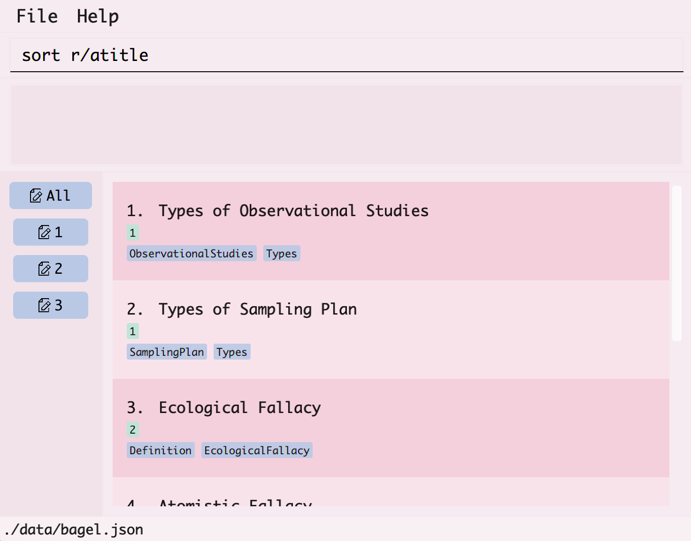
3. The sorted list of flashcards will be displayed.
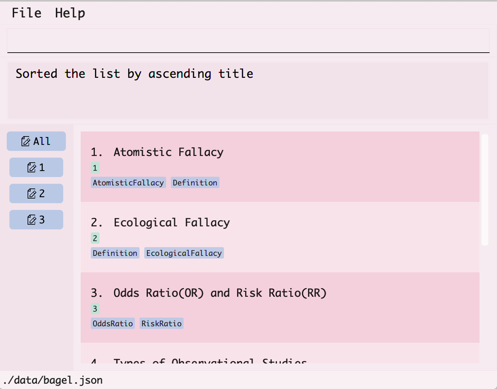

### Clearing all flashcard entries: `clear`

Want to forget everything? This command clears all flashcard entries from Bagel.

Format: `clear`

**:information_source: Warning:** 
Once you use this clear command, there is no way to undo this and retrieve all your flashcards! Make sure that you have a copy of your file somewhere else, or
that you would like to delete all your current flashcards!

### View help: `help`

Need some help? This command shows a message for link to available commands that you can use, with format and examples (i.e. User Guide).

The help window prompt should look something like this:

Format: `help`

**:information_source: Tip:** 
You can also enter "F1" on your keyboard to access this help window!

### Exiting the program: `exit`

Say goodbye to Bagel! This command lets you exit the program.

Format: `exit`

--------------------------------------------------------------------------------------------------------------------

## FAQ

**Q**: Where is the data from Bagel stored? 
**A**: By default, a data folder will be created in the same folder as the `bagel.jar` file.
After running the app for the first time, you can change the file path by editing `preferences.json`
in the same folder directly. Since your data is stored locally in your hard disk, you will not have to worry about any data theft.

**Q**: How do I transfer my data to another computer? 
**A**: Install Bagel in the other computer and copy-and-paste the data folder into the same folder
as the `bagel.jar` file.

--------------------------------------------------------------------------------------------------------------------

## Glossary

* __Duplicate flashcard__: Two flashcards that have the same title and description are considered duplicate flashcards.
Duplicate flashcards are disallowed, even if they have different links, set numbers, or tags. This is to ensure that users will not make a mistake
while adding flashcards, and to prevent confusion.

* __Mainstream OS__: Windows, Linux, Unix, OS-X

* __Set__: It acts similarly to a folder in the real world. To categorize your flashcards, and maximise your efficiency,
do be sure to make use of the 'set' feature to place flashcards into different sets.

--------------------------------------------------------------------------------------------------------------------

## Command summary

Action | Format, Examples
--------|------------------
**Add** | `add t/TITLE d/DESCRIPTION [s/SET] [l/LINK] [tag/TAG]…`  e.g., `add t/Data Analysis d/The definition of Data Analysis is…`
**Delete** | `delete INDEX`  e.g., `delete 3`
**Edit** | `edit INDEX [t/TITLE] [d/DESCRIPTION] [s/SET] [l/LINK] [tag/TAG]`  e.g., `edit 1 t/Data analysis`
**View** | `view INDEX`  e.g., `view 1`
**List** | `list [s/SET]`  e.g., `list s/2`
**Flip** | `flip`
**Search** | `search k/KEYWORD`   e.g., `search k/Data`
**Sort** | `sort r/REQUIREMENT`   e.g., `sort r/tag`
**Clear** | `clear`
**Help** | `help`
**Exit** | `exit`

--------------------------------------------------------------------------------------------------------------------

## Delegation of User Guide

Introduction: Tan Jing Yi Jace
Quick start: Liu Yuxi, Rachel Gina Abelarde, Tan Jing Yi Jace, Yong Shan Rong, Yuki Akizuki
Features:
Help: Rachel Gina Abelarde
Add: Rachel Gina Abelarde
Clear: Rachel Gina Abelarde
Delete: Rachel Gina Abelarde
Edit: Yong Shan Rong
View: Liu Yuxi
List: Tan Jing Yi Jace
Flip: Yuki  Akizuki
Search: Yuki  Akizuki
Sort: Liu Yuxi
FAQ: Liu Yuxi
Glossary: Tan Jing Yi Jace
Command Summary: Liu Yuxi, Rachel Gina Abelarde, Tan Jing Yi Jace, Yong Shan Rong, Yuki Akizuki
